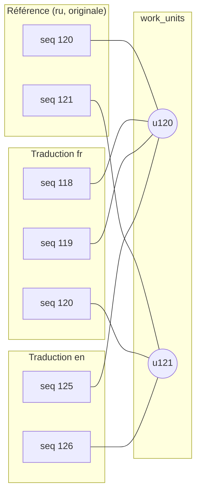
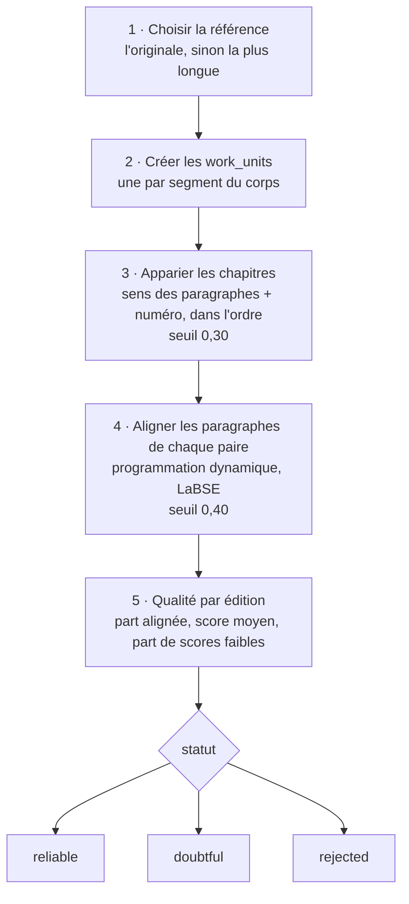
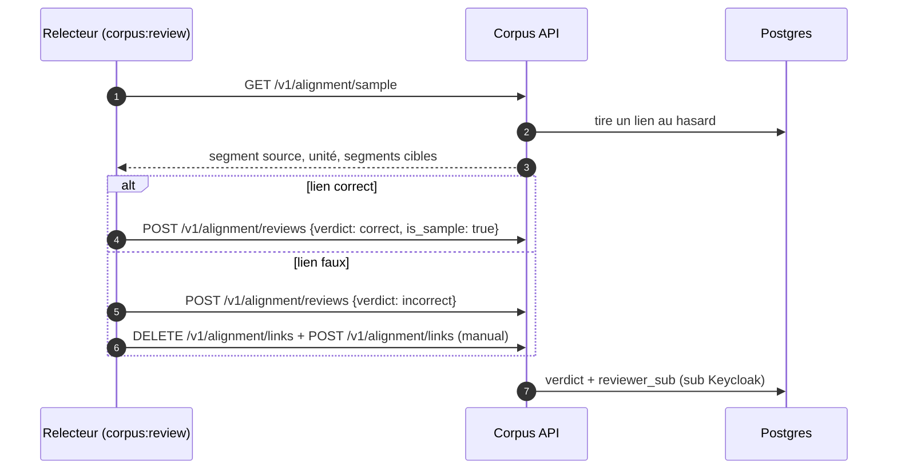

# Alignement des traductions

L'alignement permet de **passer d'un passage à sa traduction** : changer
d'édition sans perdre sa place, lire côte à côte, joindre les traductions
aux résultats de recherche.

## Le pivot : les unités de l'œuvre

Plutôt que d'aligner chaque paire d'éditions (n² paires), toutes les
éditions sont alignées sur une **édition de référence**, dont chaque segment
du corps devient une **unité** (`work_units`) de l'œuvre.

Les liens sont **n-n** : un paragraphe original peut correspondre à deux
paragraphes traduits (1-2), ou l'inverse (2-1). fr → en passe par les unités,
sans alignement direct entre les deux traductions.

## Algorithme (`thot-labse-v1`)

L'alignement de paragraphes est **monotone** (une traduction suit l'ordre de
l'original) : à chaque pas, la programmation dynamique choisit le meilleur
regroupement parmi 1-1, 1-2, 2-1, 1-0, 0-1 (et 1-3, 3-1), selon le cosinus
entre vecteurs **LaBSE** des éléments regroupés, avec une légère pénalité
pour les fusions.

- Travailler **chapitre par chapitre** borne le coût et empêche une erreur de
  se propager à tout le livre.
- Les liens **manuels** (`method = 'manual'`) ne sont jamais écrasés : une
  œuvre qui en contient n'est réalignée qu'avec `--force` (ou à partir d'une
  section depuis la console).
- Le statut `doubtful` écarte les adaptations et traductions abrégées des
  analyses ; la liseuse retombe alors sur le chapitre correspondant.

## Utilisation par l'API

| Endpoint | Rôle |
| --- | --- |
| `GET /v1/works/{id}/alignment` | qualité de chaque édition |
| `GET /v1/editions/{id}/counterpart?seq=&lang=` | position équivalente ; `via: segment` ou repli `via: section` |
| `GET /v1/editions/{id}/parallel?target=&from_seq=&to_seq=` | paires de groupes de segments pour la lecture côte à côte |

## Relecture humaine

Les verdicts tirés au hasard (`is_sample`) mesurent la **précision** de
l'aligneur par méthode, avec un intervalle de Wilson : c'est le chiffre qui
permet de filtrer les analyses par confiance. La console ajoute un atelier
complet (carte par section, vue côte à côte éditable, réalignement) — voir
[Console](#console).
