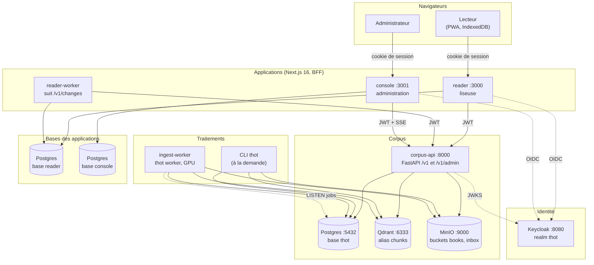
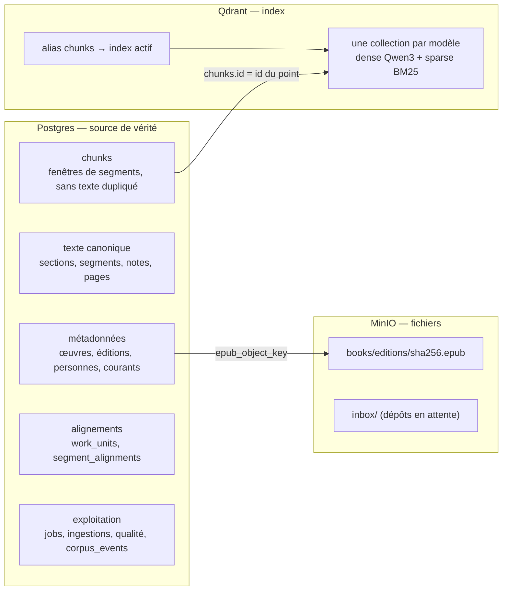
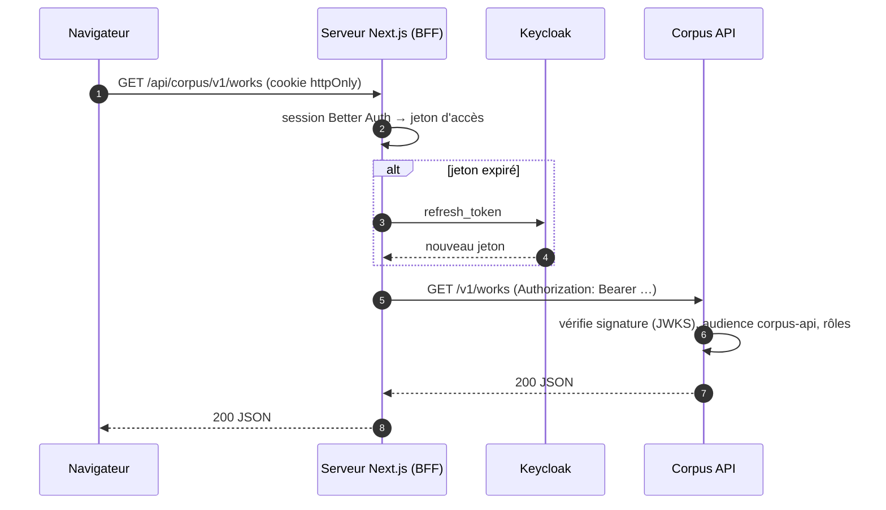
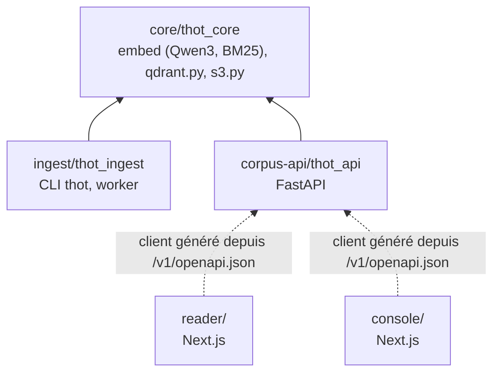

# Architecture

Thot est découpé en trois couches : le **corpus** (trois bases de données),
la **Corpus API** qui l'expose, et les **applications** qui ne passent que
par l'API. Les traitements lourds (EPUB, embeddings, alignement) sont faits
par l'**ingestion**, en ligne de commande ou par le worker.

## Vue des conteneurs

## Qui écrit où

| Composant | Postgres `thot` | Qdrant | MinIO | Base propre |
| --- | --- | --- | --- | --- |
| CLI `thot` / worker | œuvres, éditions, texte, chunks, alignements, qualité, `corpus_events` | points des chunks, payload | EPUB (`books/`) | — |
| Corpus API | verdicts d'alignement, fiches et structure (admin), file `jobs` | lecture (+ activation d'alias) | dépôts dans `inbox` ; lecture des EPUB | — |
| Liseuse | — | — | — | `reader` : préférences, progression, favoris, collections |
| Console | — | — | — | `console` : sessions |
| Keycloak | — | — | — | `keycloak` : comptes, realm |

Les quatre bases Postgres (`thot`, `reader`, `console`, `keycloak`) vivent sur
le **même serveur** Postgres mais restent indépendantes : aucune jointure
entre elles, chaque application n'accède qu'à la sienne.

## Le corpus, trois stockages complémentaires

- **Postgres** est la référence : le texte n'est stocké qu'une fois
  (`segments`), les chunks ne sont que des intervalles de `seq`.
- **Qdrant** est un index reconstructible : chaque point porte l'id du chunk
  et un payload recopié de Postgres (langue, œuvre, droits `access`…).
- **MinIO** garde l'EPUB d'origine, servi en flux par l'API ; il n'est
  jamais exposé aux navigateurs.

## Le patron BFF des applications

La liseuse et la console suivent le même modèle *Backend For Frontend* : le
navigateur ne parle **qu'au serveur Next.js**, qui détient les jetons.

Conséquences : pas de CORS à ouvrir sur l'API, aucun jeton dans le
navigateur, proxy en **liste blanche** des chemins autorisés.

## Paquets du dépôt

Les paquets Python forment un **espace de travail uv** (un seul `.venv` à la
racine) ; `thot_core` est partagé pour que l'ingestion et l'API encodent les
textes exactement de la même façon. Les applications TypeScript génèrent leur
client typé (`openapi-typescript` + `openapi-fetch`) depuis le contrat
OpenAPI de l'API.

Voir aussi : [Données](#donnees), [Corpus API](#corpus-api),
[Authentification](#authentification), [Déploiement](#deploiement).
