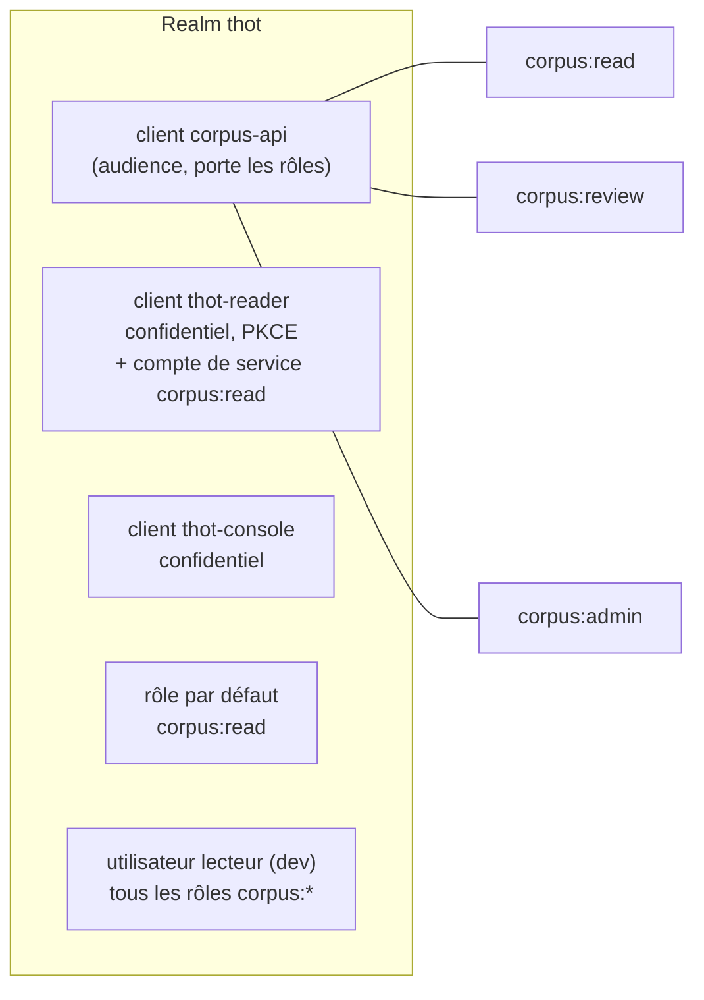
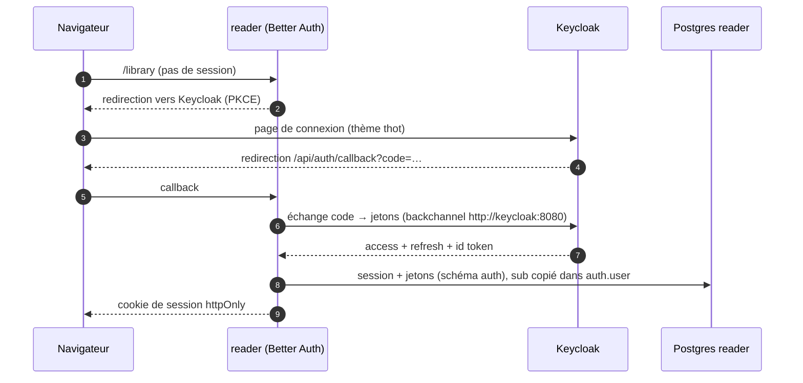
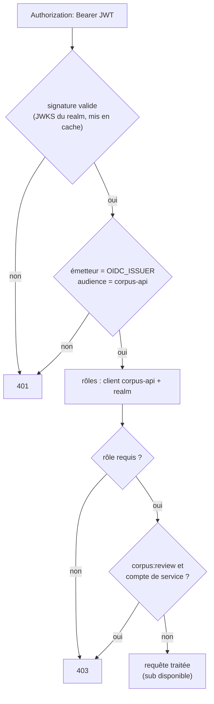

# Authentification et droits

L'identité est entièrement déléguée à **Keycloak** (realm `thot`). Aucune
brique du corpus ne stocke de compte : l'API ne connaît que le `sub` du
jeton, et chaque application clé ses données sur ce `sub`.

## Realm `thot`

| Rôle | Autorise |
| --- | --- |
| `corpus:read` | catalogue, texte des éditions accessibles, recherche, alignements |
| `corpus:review` | verdicts et corrections d'alignement, atelier de la console (**jeton utilisateur** obligatoire) |
| `corpus:admin` | éditions `restricted`, supervision, dépôts, fiches, index |

Le realm est importé au premier démarrage depuis
`keycloak/import/thot-realm.json` (URLs et secrets injectés par variables
d'environnement), puis ignoré s'il existe déjà. Le thème de connexion
`keycloak/themes/thot` reprend les couleurs de la liseuse.

## Les trois façons d'appeler l'API

| Appelant | Flux OAuth | Exemple |
| --- | --- | --- |
| Lecteur connecté via une app | code + PKCE, jeton utilisateur relayé par le BFF | lire, enregistrer sa progression |
| Visiteur anonyme | `client_credentials` du compte de service de l'app | parcourir le catalogue des éditions `open` |
| Script ou worker | `client_credentials` | `reader-worker`, notebook d'analyse |

## Connexion à la liseuse

La console suit exactement le même schéma avec le client `thot-console`, et
refuse l'accès sans `corpus:admin` ou `corpus:review`.

## Vérification côté API

- En conteneur, les clés sont lues par le réseau interne
  (`OIDC_DISCOVERY_URL = http://keycloak:8080/realms/thot`) tandis que
  l'émetteur attendu reste l'URL publique (`http://localhost:8080/realms/thot`) :
  Keycloak tourne avec `KC_HOSTNAME_BACKCHANNEL_DYNAMIC`.
- Le client doit ajouter l'audience `corpus-api` aux jetons (mapper
  « Audience »).
- En développement, `AUTH_DISABLED=true` accorde tous les droits sans jeton.
