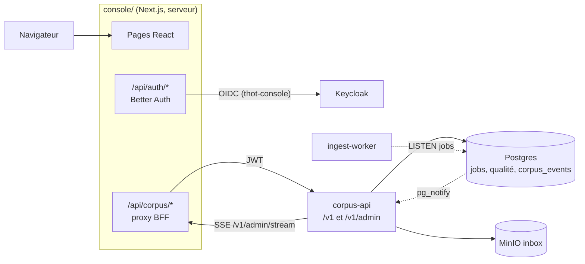
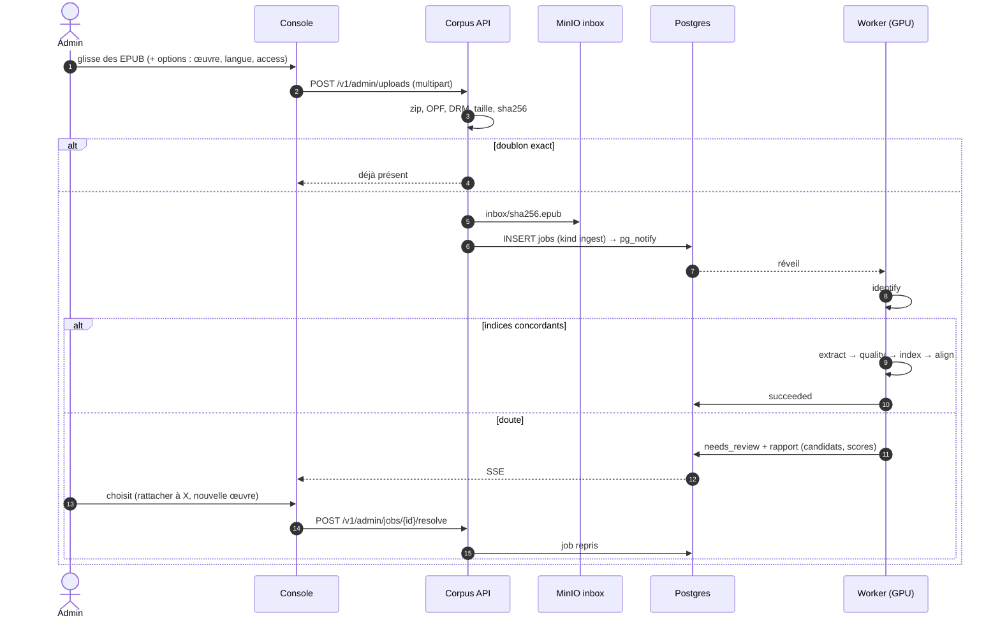
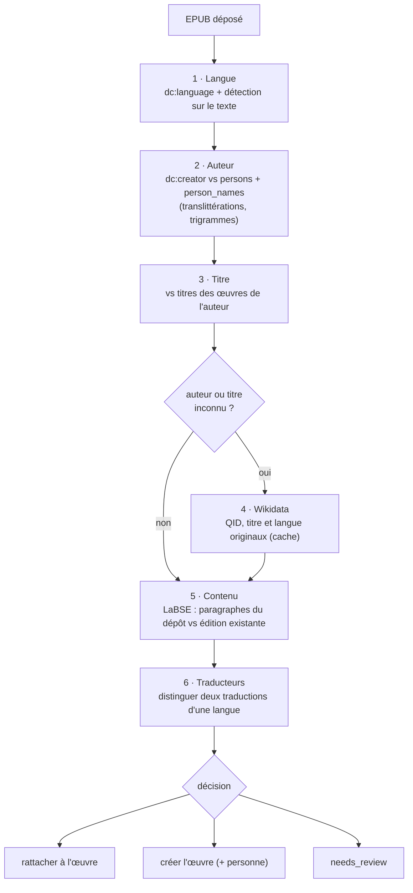

# Console d'administration (`console/`)

Application web réservée aux administrateurs du corpus. Comme la liseuse,
elle passe **uniquement par la Corpus API** ; c'est l'API (et le
[worker](#worker)) qui écrivent dans Postgres, Qdrant et MinIO.

> État : côté serveur réalisé et testé (migrations, worker, qualité,
> classement, `/v1/admin/*`). Application : vue d'ensemble, dépôt, tâches,
> qualité, œuvres, index, historique, corbeille ; le reste est en cours.

## Architecture

- **Temps réel** : l'API écoute `jobs` et `corpus_events` (`LISTEN`), publie
  un flux SSE `/v1/admin/stream`, relayé par le BFF ; la console invalide les
  requêtes TanStack Query concernées.
- **Dépôts** : le fichier passe par le BFF puis l'API, qui l'écrit dans le
  bucket `inbox` (pas d'URL présignée : MinIO reste invisible).

## Dépôt et classement automatique

Par décision, **chaque dépôt est validé à la main** pour l'instant
(`IDENTIFY_AUTO=false`).

### Identification de l'œuvre

## Modifier les fiches et la structure

| Objet | Modifiable | Effet |
| --- | --- | --- |
| Œuvre | titres, auteurs, année, langue, courants, QID ; fusion ; corbeille | `sync_payload` si un champ copié dans Qdrant change |
| Édition | titre, langue, original, éditeur, traducteurs, `access` ; déplacement vers une autre œuvre ; corbeille, purge | `sync_payload`, `align` des œuvres concernées |
| Personne | noms par langue, dates, QID ; fusion | variantes réutilisées par le classement |
| Courant | arbre, œuvres rattachées | — |
| Structure | type, matter, titre, numéro ; déplacer, scinder, fusionner des sections | job `reprocess` : redécoupage, réindexation, réalignement |

Le **texte** n'est pas modifiable : il vient de l'EPUB ; pour le corriger, on
redépose un EPUB (nouvelle révision de la même édition).

## Qualité des ouvrages

`edition_quality` combine des mesures **au parsing** (méthode de structure,
avertissements, langue détectée) et **calculées depuis la base** (chapitres,
notes orphelines, longueur des segments, part hors corps, indexation,
alignement). Elles produisent des **signaux** et un score de 0 à 100 :

| Signal | Condition |
| --- | --- |
| Pas de table des matières | structure déduite des titres |
| Langue incohérente | détectée ≠ fiche |
| Corps vide ou maigre | peu de segments, ou > 30 % hors corps |
| Segments anormaux | > 5 000 caractères, ou médiane < 40 |
| Notes cassées | appels sans note, notes jamais appelées |
| Chapitres suspects | 0 ou 1 chapitre, sections vides |
| Pas indexée / pas alignée | absente de l'index actif, alignement douteux |
| Incohérence de stockage | EPUB absent, points Qdrant ≠ chunks |

Un signal peut être marqué « vu, accepté » (`quality_acks`).

## Pages

| Chemin | Contenu |
| --- | --- |
| `/` | santé, entonnoir (déposés → extraits → indexés → alignés), tâches, échecs |
| `/upload` | dépôt et suivi |
| `/jobs`, `/jobs/[id]` | file, historique, détail, résolution d'un `needs_review` |
| `/quality` | éditions, pastilles, score |
| `/works`, `/works/[id]` | fiches éditables, éditions, fusion |
| `/indexes` | index vectoriels, activation |
| `/events` | historique des modifications |
| `/trash` | corbeille (purge après 30 jours) |
| `/alignment/*` | atelier d'alignement (en cours) |
