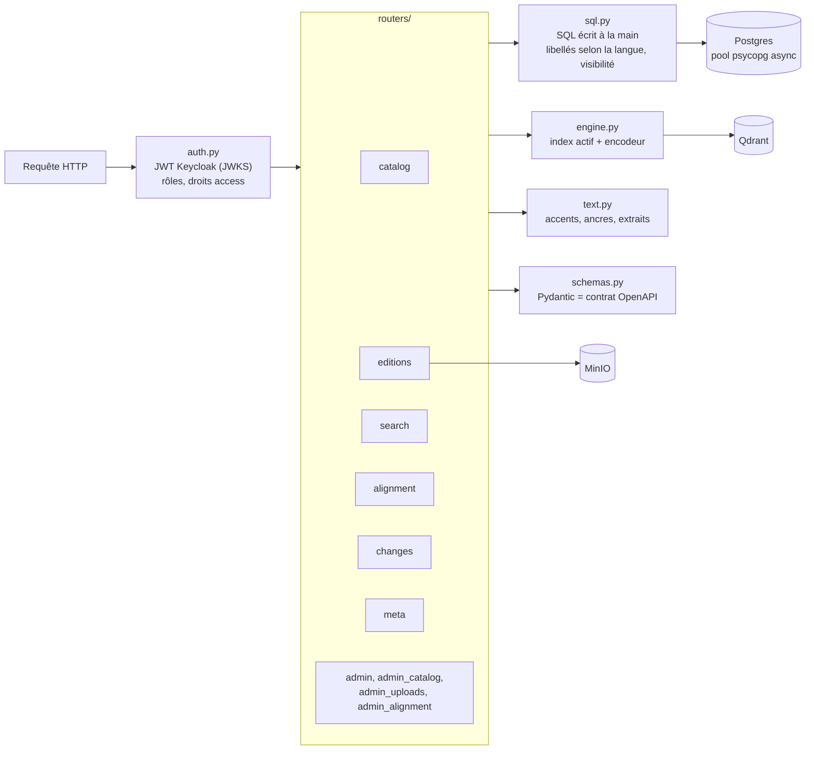
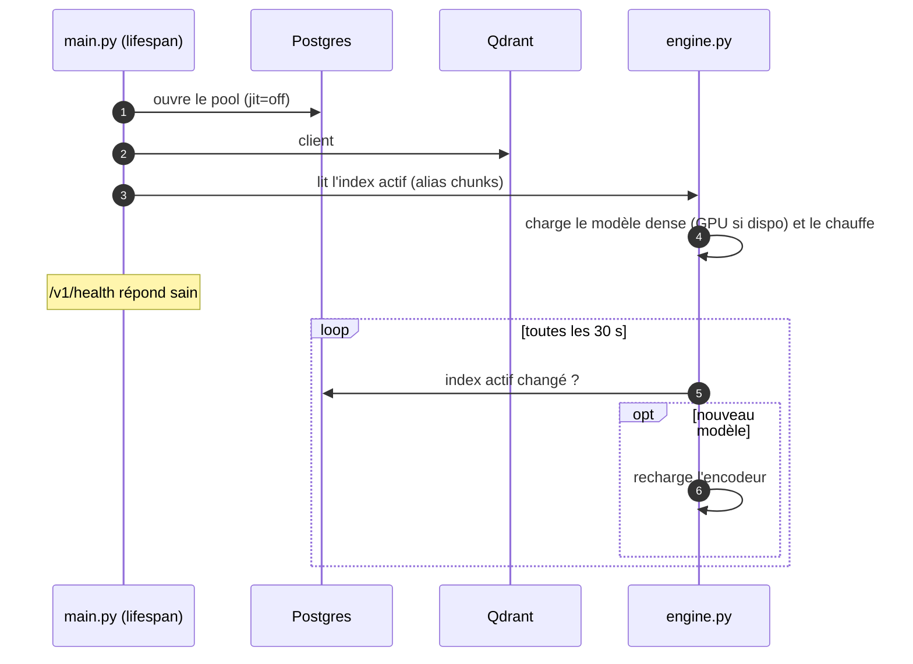
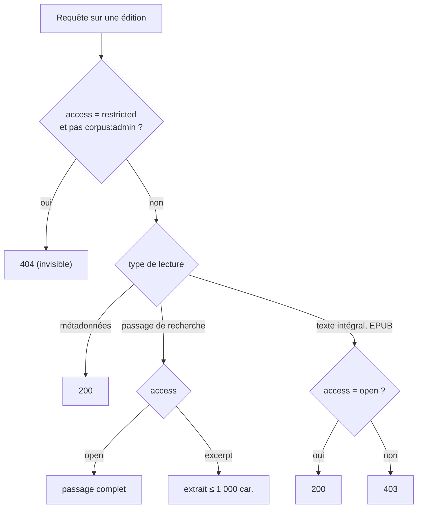

# Corpus API

API HTTP (FastAPI, `corpus-api/`) au-dessus du corpus. **Seule porte
d'entrée** des applications : le schéma des bases reste un détail
d'implémentation. Documentation interactive sur `/v1/docs`, contrat sur
`/v1/openapi.json`.

## Principes

- **Versionnée** sous `/v1` ; un changement incompatible = `/v2`, `/v1`
  maintenu le temps de migrer.
- **Ressources du domaine**, pas des tables : œuvre, édition, table des
  matières, passage, résultat de recherche, alignement.
- **Aucune donnée utilisateur** : seul le `sub` du jeton est connu.
- **Identifiants publics** : UUID des œuvres, éditions, personnes, courants
  et sections ; un segment se désigne par `(edition_id, revision, seq)`.
- JSON `snake_case`, dates ISO 8601, langues BCP 47, erreurs RFC 9457
  (`application/problem+json`), pagination par curseur opaque.

## Structure interne

## Cycle de vie

## Endpoints

| Groupe | Endpoints principaux | Rôle |
| --- | --- | --- |
| Catalogue | `GET /v1/works`, `/works/{id}`, `/persons`, `/movements`, `/languages`, `/suggest` | `corpus:read` |
| Texte | `GET /v1/editions/{id}`, `/toc`, `/segments`, `/position`, `/notes/{id}`, `/find`, `/epub` | `corpus:read` (+ droits `access`) |
| Ancres | `POST /v1/editions/{id}/anchors:resolve` | `corpus:read` |
| Recherche | `POST /v1/search`, `POST /v1/similar` | `corpus:read` |
| Alignement | `GET /v1/works/{id}/alignment`, `/editions/{id}/counterpart`, `/parallel`, `/alignment/sample` | `corpus:read` |
| Relecture | `POST /v1/alignment/reviews`, `POST`/`DELETE /v1/alignment/links` | `corpus:review` (jeton utilisateur) |
| Changements | `GET /v1/changes?after=` | `corpus:read` |
| Service | `GET /v1/health` (sans jeton), `GET /v1/meta` | — |
| Administration | `/v1/admin/*` (voir ci-dessous) | `corpus:admin` (atelier : `corpus:review`) |

## Droits sur les textes

## Cache et EPUB

- Réponses de texte : `ETag: "<edition_id>:<revision>"` ; avec `?rev=`, le
  contenu est **immuable** (`Cache-Control: immutable`, un an) ; une révision
  obsolète répond `409`.
- `GET /v1/editions/{id}/epub` : flux depuis MinIO **à travers l'API**
  (MinIO jamais exposé), `ETag` = sha256, `Range` → `206`.

## Administration (`/v1/admin`)

| Domaine | Endpoints |
| --- | --- |
| Supervision | `GET /overview`, `GET /stream` (SSE), `GET /consistency`, `GET /events` |
| Tâches | `GET`/`POST /jobs`, `GET /jobs/{id}`, `POST /jobs/{id}/cancel`, `/retry`, `/resolve` |
| Dépôts | `POST /uploads` (multipart, un ou plusieurs EPUB) |
| Qualité | `GET /quality`, `GET /quality/signals`, `POST`/`DELETE /quality/{edition_id}/acks` |
| Fiches | `GET`/`PATCH`/`DELETE /works/{id}`, `/restore`, `/merge` ; `PATCH /editions/{id}`, `/move`, `/restore`, `/purge` ; personnes, courants, `GET /trash` |
| Structure | `GET /editions/{id}/structure`, modification, scission et fusion de sections |
| Alignement | `GET /alignment/editions`, `/editions/{id}/map`, `/workbench`, `POST /links/replace`, `/status`, `GET /precision` |
| Index | `GET /indexes`, `POST /indexes/{collection}/activate` |

Toute écriture d'administration est journalisée dans `corpus_events`
(acteur = `sub` de l'admin), utilise la concurrence optimiste (`If-Match`,
`412`) et délègue les traitements lourds au [worker](#worker).

## Performances mesurées

| Endpoint | Visé (p95) | Mesuré (36 éditions, GPU) |
| --- | --- | --- |
| catalogue, fiche, toc, segments | < 50 ms | 5–40 ms |
| `find` | < 150 ms | ~40 ms |
| `search` `words` | < 200 ms | ~60 ms |
| `search` `theme` | < 200 ms | 80–300 ms |
| `search` `quote` + traductions | < 350 ms | ~430 ms |
| `anchors:resolve` | — | ~100 ms |
