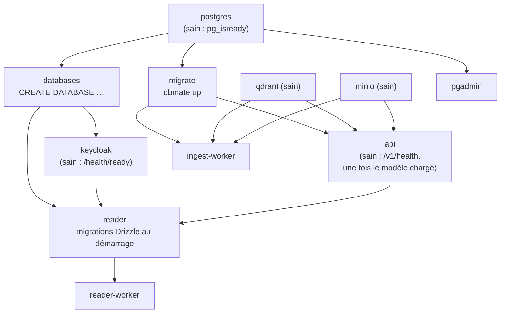
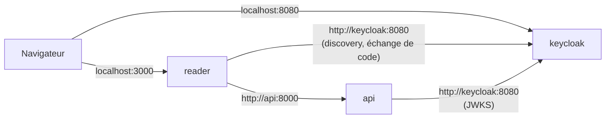

# Déploiement (Docker Compose)

Toute la pile démarre avec une commande :

```bash
cp .env.example .env          # ajuster les mots de passe
docker compose up -d --build
```

## Services

| Service | Adresse | Rôle |
| --- | --- | --- |
| `postgres` | :5432 | bases `thot` (corpus), `keycloak`, `reader`, `console` |
| `migrate` | — | applique `db/migrations/` (dbmate), puis s'arrête |
| `databases` | — | crée les bases `keycloak`, `reader`, `console` (idempotent), puis s'arrête |
| `keycloak` | :8080/admin | identité, realm `thot` |
| `qdrant` | :6333 / :6334 | index vectoriels (REST / gRPC) |
| `minio` | :9000 / :9001 | EPUB (API S3 / console web) |
| `api` | :8000/v1/docs | Corpus API |
| `ingest-worker` | — | `thot worker`, file de tâches, permanent |
| `reader` | :3000 | liseuse |
| `reader-worker` | — | suit `/v1/changes`, recale les progressions |
| `pgadmin` | :5050 | visualisation du schéma (ERD Tool) |
| `ingest` | — | profil `ingest` : commande à la demande (`docker compose run --rm ingest …`) |

La console (`console/`, port 3001) se lance pour l'instant hors compose
(`pnpm dev`).

## Ordre de démarrage



Les `depends_on` utilisent `service_healthy` et
`service_completed_successfully` : un service ne démarre que lorsque ses
dépendances sont prêtes.

## Volumes

| Volume | Contenu |
| --- | --- |
| `postgres_data` | toutes les bases Postgres |
| `qdrant_data` | collections Qdrant |
| `minio_data` | buckets `books`, `inbox` |
| `hf_cache` | modèles Hugging Face (Qwen3, LaBSE), partagés par `api`, `ingest`, `ingest-worker` |
| `pgadmin_data` | configuration pgAdmin |

Pour réutiliser les modèles déjà présents sur l'hôte :

```bash
docker run --rm -v thot_hf_cache:/c -v ~/.cache/huggingface/hub:/src:ro alpine \
  sh -c 'mkdir -p /c/hub && cp -a /src/. /c/hub/'
```

puis `HF_HUB_OFFLINE=1` dans `.env` (démarrage plus rapide).

## GPU

```bash
docker compose -f docker-compose.yml -f docker-compose.gpu.yml up -d
```

`docker-compose.gpu.yml` donne `nvidia.com/gpu=all` à `ingest`,
`ingest-worker` et `api` (NVIDIA Container Toolkit en mode **CDI** ; NixOS :
`hardware.nvidia-container-toolkit.enable = true;`). Recherche « thème » :
~50 ms par requête au lieu de ~650–900 ms sur CPU.

## Réseau : URL publiques et internes



Les jetons portent toujours l'**émetteur public** (`KEYCLOAK_URL`,
`http://localhost:8080`), tandis que les conteneurs joignent Keycloak par le
réseau interne (`KC_HOSTNAME_BACKCHANNEL_DYNAMIC`). Le client `thot-reader`
n'accepte que `READER_URL` comme redirection.

## Vérifications

```bash
docker compose ps
curl http://localhost:8000/v1/health                  # API
curl http://localhost:6333/healthz                    # Qdrant
docker compose exec postgres pg_isready -U thot       # Postgres
curl http://localhost:9000/minio/health/live          # MinIO
```

> MinIO ne publie plus d'images Docker : le compose utilise
> `minio/minio:latest` déjà présente localement. Une installation neuve
> devra passer à un autre stockage S3 (Garage, SeaweedFS…) ; seuls
> `MINIO_ENDPOINT` et les identifiants changent.
