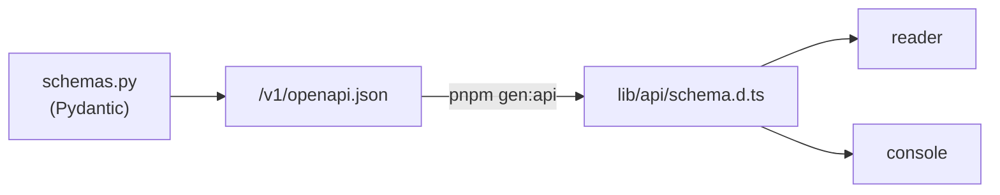

# Développement

## Environnement

```bash
nix develop                  # Python 3.12, uv, psql, dbmate, ruff, Node 22, pnpm, Playwright
uv sync --all-packages       # un seul .venv à la racine (core + ingest + corpus-api)
```

Les paquets Python forment un **espace de travail uv** (`pyproject.toml` et
`uv.lock` à la racine). Le GPU est utilisable directement depuis
`nix develop`.

## Structure du dépôt

```
thot/
├── flake.nix                # environnement de développement
├── docker-compose.yml       # toute la pile ; docker-compose.gpu.yml pour le GPU
├── pyproject.toml / uv.lock # espace de travail uv
├── core/thot_core/          # partagé : embed/ (Qwen3, BM25), qdrant.py, s3.py
├── ingest/thot_ingest/      # CLI thot, worker
│   ├── epub/  text/         # lecture EPUB, structure, segments, langue
│   ├── chunking/  align/    # découpage v1, programmation dynamique
│   ├── pipeline/            # extract, index, align, steps (worker)
│   ├── store/               # écriture Postgres, corpus_emit
│   ├── identify.py          # classement des dépôts
│   ├── quality.py  jobs.py  worker.py  wikidata.py
│   └── cli.py
├── corpus-api/thot_api/     # FastAPI : main, auth, engine, sql, text, schemas, routers/
├── reader/                  # liseuse (Next.js 16, PWA)
├── console/                 # console d'administration (Next.js 16)
├── keycloak/                # realm importé, thème de connexion
├── db/migrations/           # dbmate
├── docs/                    # documents de conception (API, liseuse, console)
└── documentation/           # ce site (Barjavel)
```

## Ingestion

```bash
uv run thot --help
uv run pytest ingest/tests          # EPUB synthétiques, sans base
```

## Corpus API

```bash
# sans Keycloak : tous les droits, aucun jeton vérifié
AUTH_DISABLED=true HF_HUB_OFFLINE=1 \
  uv run uvicorn thot_api.main:create_app --factory --reload

uv run pytest corpus-api/tests
```

Les tests d'intégration copient la base `thot` dans `thot_api_test`
(`CREATE DATABASE … TEMPLATE`) : aucune session ne doit être ouverte sur
`thot` pendant les tests, sinon ils sont ignorés. Les tests d'écriture
(admin) ne touchent jamais la vraie base.

## Liseuse et console

```bash
cd reader                         # ou console/
cp .env.example .env.local
pnpm install
pnpm db:migrate                   # Drizzle
pnpm dev                          # reader :3000, console :3001

pnpm gen:api                      # régénère lib/api/schema.d.ts depuis /v1/openapi.json
pnpm lint && pnpm typecheck && pnpm test
pnpm build && pnpm test:e2e       # Playwright, base jetable reader_e2e
pnpm worker --once                # (reader) synchronisation /v1/changes
```

Le client Keycloak `thot-reader` n'accepte que `READER_URL` : les tests de
bout en bout ont besoin du port 3000 libre (`docker compose stop reader`).

## Boucle de contrat



Modifier un modèle Pydantic change le contrat ; régénérer le client fait
remonter les incompatibilités à la compilation TypeScript.

## Migrations

```bash
dbmate status
dbmate up
dbmate new <nom>                  # db/migrations/<horodatage>_<nom>.sql
```

## Cette documentation

Le site est généré par [Barjavel](https://github.com/Herzaristide/barjavel)
depuis `documentation/content/*.md` :

```bash
cd documentation
npm install
npm run dev                       # http://localhost:5173
npm run build                     # site statique dans dist/
```

Il est publié sur GitHub Pages par `.github/workflows/docs.yml` à chaque push
sur `main` qui touche `documentation/`.
