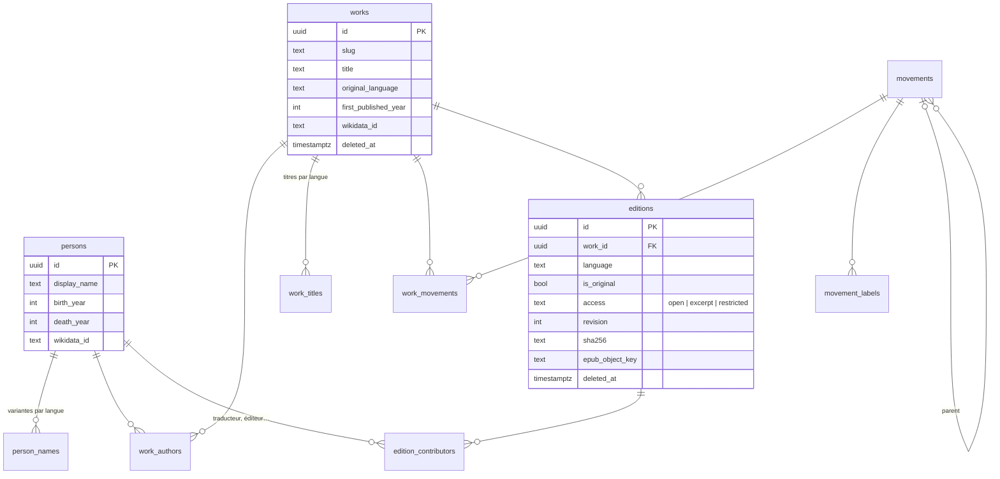
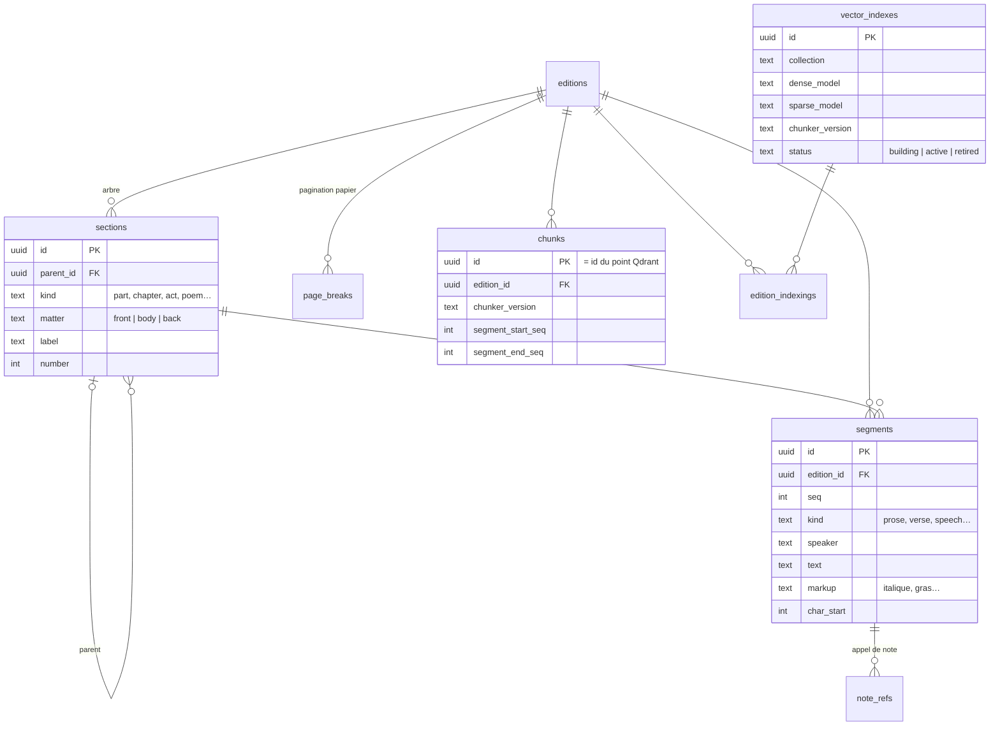
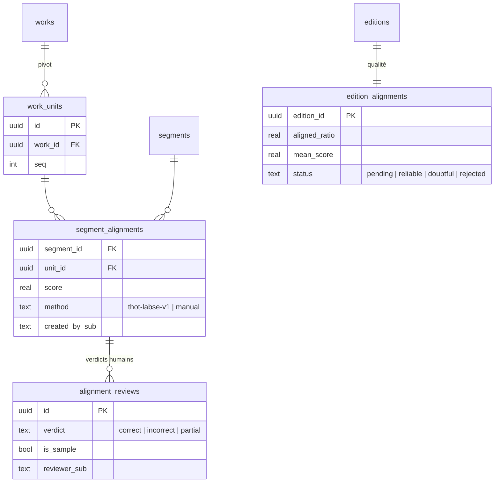
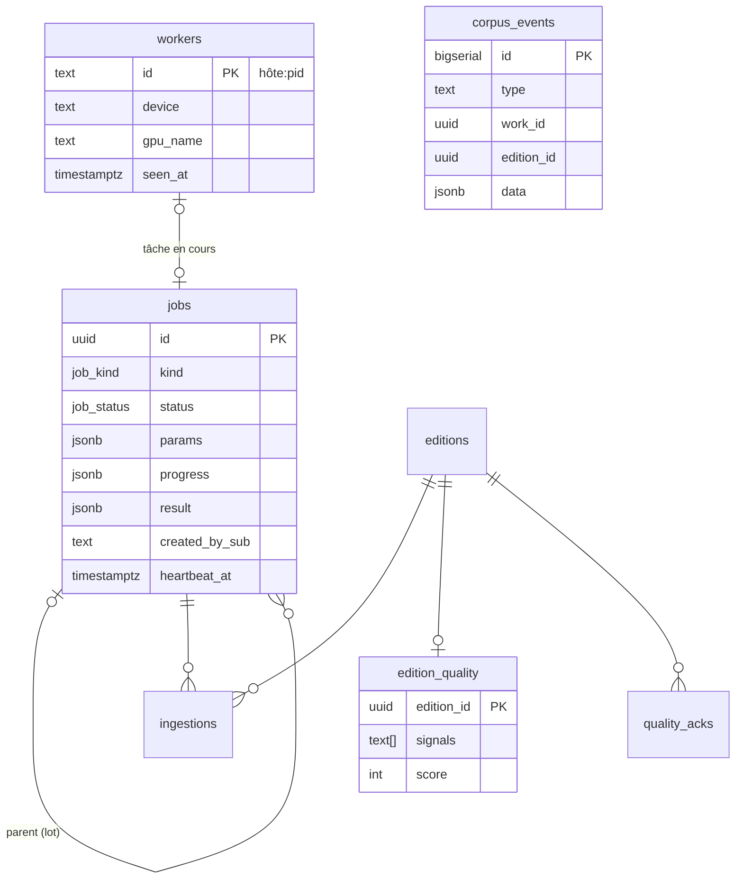

# Modèle de données

Le schéma de la base `thot` évolue par **migrations dbmate**
(`db/migrations/`), appliquées par le service `migrate` à chaque démarrage.
Une base n'est jamais recréée : toute évolution passe par une nouvelle
migration (`-- migrate:up` / `-- migrate:down`).

## Œuvres et éditions

Une **œuvre** (`works`) est l'entité abstraite, indépendante de la langue.
Une **édition** (`editions`) en est une version concrète : un fichier, une
langue, un traducteur, un EPUB. Les traductions d'un même livre sont donc
plusieurs éditions d'une même œuvre.

## Texte canonique

Le texte d'une édition est stocké **une seule fois**, en `segments` :
paragraphes ordonnés par `seq`, sans chevauchement, typés (titre, prose,
vers, réplique + personnage, didascalie, épigraphe, citation, note). La
structure est un arbre de `sections`.

- `chunks` ne contient **aucun texte** : ce sont des fenêtres
  `[segment_start_seq, segment_end_seq]` (vue `chunk_texts`). Plusieurs découpages
  (`chunker_version`) coexistent : on peut re-chunker sans toucher au texte.
- `vector_indexes` : une collection Qdrant par modèle d'embedding, une seule
  `active` à la fois. `edition_indexings` suit le remplissage édition par
  édition.
- Vues utiles : `edition_texts` (le livre complet), `section_paths`
  (« Première partie > Chapitre III »), fonction `section_ranges()`.

## Alignements

Les `work_units` sont le **pivot** : une unité par segment du corps de
l'édition de référence. Passer du français à l'anglais =
segments FR → unités → segments EN. Détails : [Alignement](#alignement).

## Exploitation

- `corpus_events` : journal des changements, écrit par `corpus_emit()` **dans
  la même transaction** que la modification ; servi par `/v1/changes`.
- `jobs` / `workers` : file de tâches et présence des workers
  (voir [Worker et tâches](#worker)).
- `edition_quality` / `quality_acks` : signaux de qualité par édition
  (voir [Console](#console)).
- `wikidata_cache` : réponses Wikidata du classement automatique.

## Migrations

| Fichier | Contenu |
| --- | --- |
| `00`–`10` | schéma initial : extensions, personnes, œuvres, courants, éditions, sections et segments, chunks, alignements, index vectoriels, ingestions |
| `11_users`, `12_alignment_reviews` | relectures humaines (les comptes sont ensuite retirés au profit de Keycloak) |
| `20261002120000_corpus_api` | `editions.access`, `editions.revision`, `corpus_events`, `section_ranges()`, `pg_trgm` + `unaccent` |
| `20261003120000_console` | `jobs` (+ `pg_notify`), `ingestions.job_id/stage`, `edition_quality`, `quality_acks`, corbeille (`deleted_at`), `wikidata_cache` |
| `20261003130000_workers` | table `workers` (présence, GPU, modèles chargés) |

Les fichiers `00`–`12` sont figés : ils ne se modifient plus.
