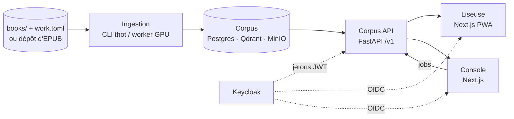

# Thot

Thot est une **bibliothèque d'œuvres littéraires multilingue**. Un même
livre existe en plusieurs langues et traductions (le *Crime et Châtiment*
russe, la traduction française de Markowicz, l'anglaise de Garnett…) : Thot
les range sous une seule **œuvre**, les rend **cherchables par le sens**
dans toutes les langues, et **aligne** leurs paragraphes pour passer d'une
traduction à l'autre sans perdre sa place.

## Ce que fait le système

| Brique | Rôle |
| --- | --- |
| **Ingestion** (`ingest/`, CLI `thot`) | lit les EPUB, en extrait la structure et le texte canonique, vectorise, aligne les traductions |
| **Corpus** (Postgres + Qdrant + MinIO) | métadonnées et texte, index vectoriels, fichiers EPUB |
| **Corpus API** (`corpus-api/`, FastAPI) | seule porte d'entrée des applications : catalogue, texte, recherche, alignements, flux des changements, administration |
| **Keycloak** | identité, rôles `corpus:read` / `corpus:review` / `corpus:admin` |
| **Liseuse** (`reader/`, Next.js PWA) | lire, chercher, lecture parallèle, hors ligne |
| **Console** (`console/`, Next.js) | déposer des livres, superviser, qualité, fiches, atelier d'alignement |
| **Worker** (`thot worker`, GPU) | exécute la file de tâches : dépôts, retraitements, alignements, corbeille |

## Vue d'ensemble

## Principes structurants

- **Œuvre ≠ édition** : la recherche se fait sur les œuvres, chaque
  traduction est une édition avec son texte, sa langue, ses traducteurs.
- **Corpus découplé** : les applications ne voient jamais Postgres, Qdrant
  ou MinIO, uniquement l'API versionnée `/v1`. On peut re-chunker ou changer
  de modèle d'embedding sans casser les clients.
- **Aucune donnée utilisateur dans le corpus** : l'API ne connaît que le
  `sub` Keycloak ; progression, favoris, collections vivent dans la base de
  chaque application.
- **Positions stables** : une position dans un texte est une ancre
  `(edition_id, revision, seq, offset, quote)`, recalée quand le texte change.
- **Droits par édition** : `open`, `excerpt` ou `restricted` (défaut) — une
  traduction sous droits n'est jamais publiée par oubli.

## Par où commencer

- Comprendre les briques et leurs échanges → [Architecture](#architecture).
- Le modèle de données → [Données](#donnees).
- Du fichier EPUB à l'index → [Ingestion](#ingestion).
- L'API et ses contrats → [Corpus API](#corpus-api).
- Lancer la pile → [Déploiement](#deploiement) et [Développement](#developpement).

> Astuce : `⌘K` (ou `Ctrl+K`) pour chercher dans toute la documentation.
