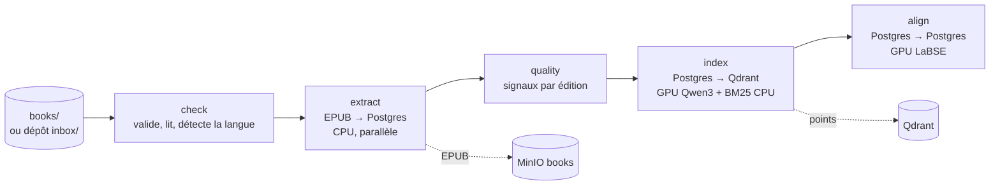
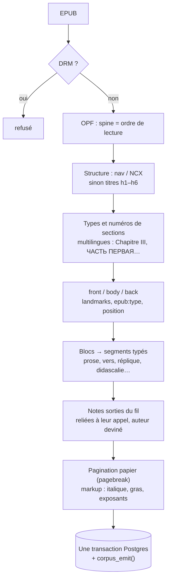
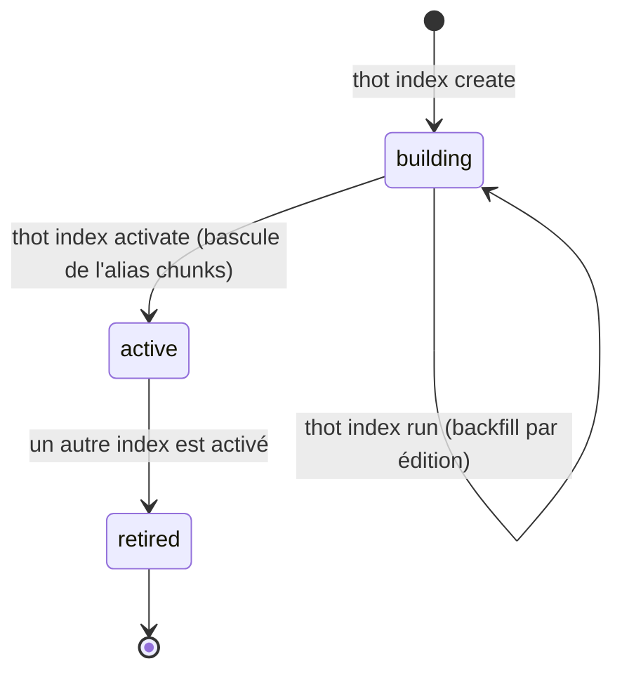

# Ingestion

Le pipeline (`ingest/`, Python, CLI `thot`) transforme des EPUB en corpus.
Il se déroule en étapes **indépendantes, relançables sans doublon**, qui
reprennent là où elles s'étaient arrêtées.



| Étape | Granularité | Matériel | Écrit |
| --- | --- | --- | --- |
| `extract` | 1× par livre | CPU, parallèle (`--workers N`) | œuvres, éditions, sections, segments, notes, pages ; EPUB dans MinIO |
| `quality` | 1× par édition | CPU | `edition_quality` |
| `index` | 1× par livre **et par modèle** | GPU (dense) + CPU (BM25) | `chunks`, points Qdrant, `edition_indexings` |
| `align` | 1× par **œuvre** (≥ 2 éditions) | GPU (LaBSE) | `work_units`, `segment_alignments`, `edition_alignments` |

## Ranger les livres

Deux voies d'entrée : le dossier `books/` (import en lot) ou le **dépôt**
depuis la [console](#console) (classement automatique).

```
books/
└── dostoievski-fiodor/
    └── crime-et-chatiment/
        ├── work.toml
        ├── ru.epub                  ← original
        ├── fr--markowicz.epub       ← <langue>--<traducteur>.epub
        └── en--garnett.epub
```

La fiche `work.toml` décrit l'œuvre (titre original, langue, année, auteurs,
courants, QID Wikidata) et chaque édition (fichier, langue, traducteurs,
éditeur, droits `access`). Depuis la console, **Postgres est la référence** :
`thot extract` crée ce qui manque mais ne réécrit plus une fiche existante
(`--overwrite-metadata` pour forcer).

## Extraction



- La licence Project Gutenberg est retirée ; les tables des matières
  aplaties de Gutenberg sont ré-imbriquées.
- « N.d.T. » → note du traducteur.
- Un texte **remplacé** (nouvel EPUB d'une édition existante) incrémente
  `editions.revision` et émet `edition.text_replaced` (voir
  [Révisions et ancres](#revisions)).
- Seul le **corps** (`matter = body`) est ensuite vectorisé.

## Découpage et indexation

Le découpeur `v1` produit des **fenêtres de segments entiers** :

| Paramètre | Valeur |
| --- | --- |
| cible | ~400 tokens |
| maximum | 512 tokens (un segment plus long reste seul) |
| chevauchement | ~60 tokens (derniers segments du chunk précédent) |
| minimum | 100 tokens (un dernier chunk trop petit est fusionné) |

Un chunk ne déborde jamais de sa section et n'inclut jamais de note.

Chaque chunk devient un point Qdrant avec deux vecteurs nommés :

- `dense` — **Qwen3-Embedding-0.6B** (1024 dimensions, cosinus), sur GPU ;
- `bm25` — vecteur creux calculé sur CPU (racinisation Snowball selon la
  langue, hachage 32 bits), l'IDF étant calculé par Qdrant.

Le payload porte de quoi filtrer sans retourner à Postgres : `work_id`,
`edition_id`, `language`, `is_original`, `access`, `author_ids`,
`movement_ids`, `first_published_year`, `section_kind`…

## Changer de modèle d'embedding



L'ancien index reste interrogeable jusqu'à la bascule, et un seul index est
`active` à la fois (changement fait dans une même transaction). L'API
détecte la bascule et recharge l'encodeur d'elle-même (vérification toutes
les 30 s).

## Commandes

```bash
thot check [--dump DIR]          # valide books/, --dump écrit le texte extrait
thot extract [--workers N]       # EPUB → Postgres (+ MinIO)
thot index create                # nouvel index (EMBEDDING_MODEL, découpage v1)
thot index run <collection>      # vectorise les éditions pas encore indexées
thot index activate <collection> # bascule l'alias de recherche
thot index sync-payload          # recopie les champs modifiables dans Qdrant
thot align [--work auteur/oeuvre]
thot quality
thot worker                      # exécute la file de tâches
thot status
thot search "un meurtre" --mode theme|quote|words --lang fr --show en
```

Les exécutions de la CLI créent aussi une ligne `jobs` (`kind = cli`) : elles
apparaissent dans la console comme celles du worker.
