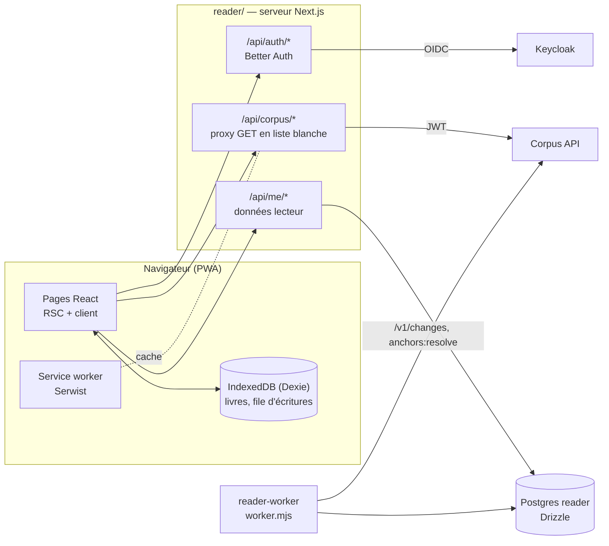
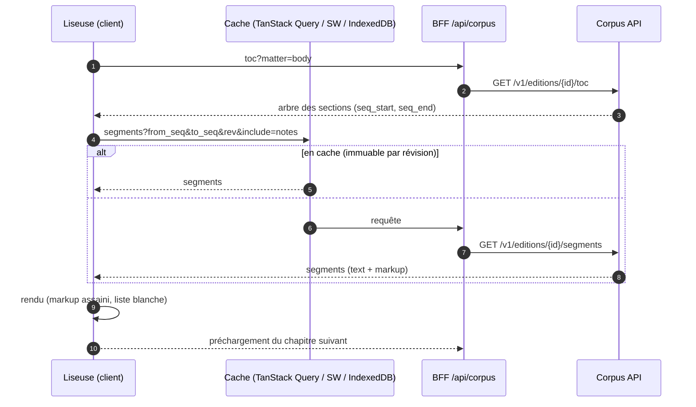
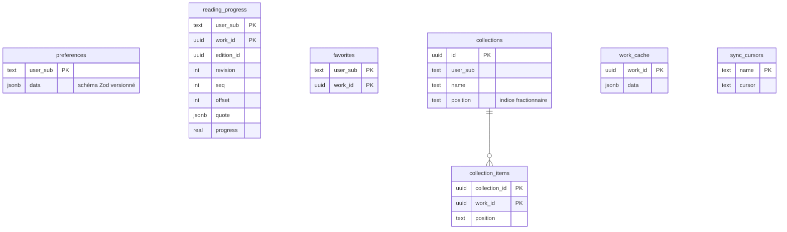
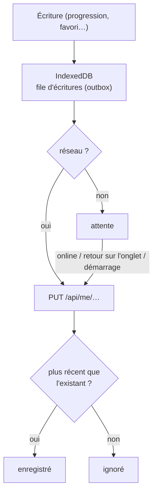

# Liseuse (`reader/`)

Application web de lecture : **PWA** installable sur ordinateur et
téléphone, lisible **hors ligne**. Elle lit le corpus **uniquement via la
Corpus API** et garde les données de ses lecteurs dans sa propre base
`reader`.

## Architecture

## Pile

| Besoin | Choix |
| --- | --- |
| Framework | Next.js 16 (App Router, Turbopack, React 19, React Compiler) |
| Styles et composants | Tailwind CSS v4, shadcn/ui (Radix), lucide, Motion |
| Données | TanStack Query v5, client `openapi-fetch` généré (`pnpm gen:api`) |
| Authentification | Better Auth + `genericOAuth` (Keycloak), jetons côté serveur |
| Base | Drizzle ORM + drizzle-kit (migrations SQL) |
| Hors ligne | Serwist (service worker), Dexie (IndexedDB) |
| Outils | pnpm, Biome, Vitest, Playwright |

## Pages

| Route | Contenu |
| --- | --- |
| `/` | continuer la lecture, favoris, collections, découvertes |
| `/explore` | catalogue filtrable, défilement infini |
| `/search` | recherche de passages (thème, citation, mots), traductions jointes |
| `/works/[id]`, `/authors/[id]`, `/movements/[id]` | fiches |
| `/read/[editionId]` | la liseuse |
| `/library`, `/library/collections/[id]` | bibliothèque personnelle (connecté) |
| `/settings` | préférences, données hors ligne |
| `/offline` | repli du service worker |

Barre de commande `⌘K` partout (`/v1/suggest`).

## Lire un chapitre

- **Deux modes** : défilement par chapitre, ou pages (colonnes CSS).
- **Réglages « Aa »** : taille, interlignage, largeur, justification,
  police, thèmes clair / sombre / sépia.
- **Traductions** : changer d'édition sans perdre sa place
  (`/counterpart`), lecture **parallèle** côte à côte sur bureau, en
  alternance sur mobile (`/parallel`).

## Données lecteur

- Clé de toutes les données : le **`sub` Keycloak**, jamais l'id interne de
  Better Auth.
- **Une progression par œuvre**, quelle que soit la traduction lue ; ouvrir
  une autre édition convertit la position par `/counterpart`.
- Écritures **idempotentes** (PUT / DELETE sur clé naturelle) : la file hors
  ligne peut les rejouer sans risque ; « le plus récent `updated_at` gagne »
  entre appareils.

## Hors ligne

| Ressource | Stratégie du service worker |
| --- | --- |
| enveloppe de l'application, `/offline` | précache |
| pages | NetworkFirst |
| `/api/corpus/*` avec `rev=` | CacheFirst (immuable) |
| `/api/corpus/*` sans `rev` | StaleWhileRevalidate |
| polices, icônes | CacheFirst |

Un livre **téléchargé** (table des matières + tous les segments, clé
`edition_id:revision`) se lit entièrement hors ligne. Une seule file
d'écritures côté client plutôt que *Background Sync*, absent de Safari et
Firefox.
