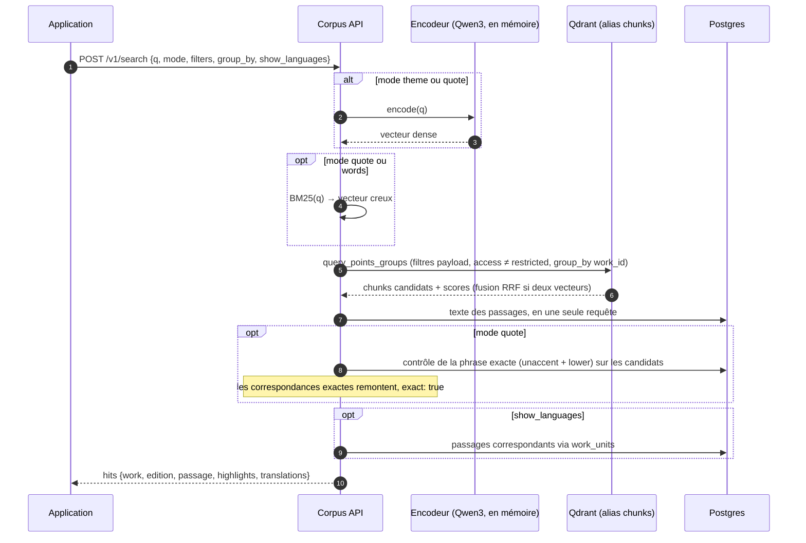
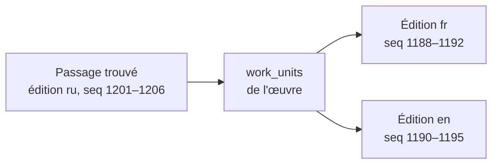

# Recherche

La recherche porte sur **les œuvres** : toutes les éditions sont indexées
(indispensable pour retrouver une citation dans la langue où elle est
collée), puis les résultats sont regroupés par `work_id`.

## Trois modes

| Mode | Vecteurs | Usage | Temps (GPU, à chaud) |
| --- | --- | --- | --- |
| `theme` | dense seul | « un homme qui se demande s'il a le droit de tuer » | 80–300 ms |
| `quote` | dense + BM25, fusion RRF, puis contrôle de la phrase exacte | une citation approximative ou traduite | ~430 ms avec traductions |
| `words` | BM25 seul | des mots exacts | ~60 ms |

Sur CPU, l'encodage d'une requête dense coûte ~650 ms contre ~50 ms sur une
RTX 3070 : le GPU est conseillé pour l'API.

## Déroulement d'une requête

## Filtres et regroupement

- **Filtres** (sur le payload Qdrant) : langues, original seulement, années,
  auteurs, courants, œuvres, éditions.
- **Droits** : les éditions `restricted` sont exclues côté Qdrant ; pour une
  édition `excerpt`, le passage est tronqué autour de la correspondance
  (≤ 1 000 caractères).
- **Regroupement** `group_by` : `work` (un passage par œuvre, défaut),
  `edition` ou `none`.
- **Pas de pagination** : `limit` ≤ 50. Le regroupement Qdrant n'offre pas de
  curseur fiable ; au-delà, mieux vaut affiner la requête.

## Traductions jointes

`show_languages: ["fr"]` joint à chaque passage son équivalent dans ces
langues, via l'[alignement](#alignement) : l'édition originale de préférence,
sinon la mieux alignée.

## Autres recherches

| Endpoint | Fonctionnement |
| --- | --- |
| `POST /v1/similar` | « plus comme ceci » : réutilise les vecteurs déjà stockés des chunks qui couvrent le passage, **aucun calcul d'embedding** |
| `GET /v1/editions/{id}/find?q=` | recherche dans un livre : parcours des segments via l'index `(edition_id, seq)`, insensible à la casse et aux accents |
| `GET /v1/suggest?q=` | autocomplétion œuvres et personnes, `pg_trgm` sur les titres et noms dans toutes les langues |

## Choix d'implémentation

- Modèle dense **chargé une fois au démarrage** puis chauffé par une requête
  factice ; `HF_HUB_OFFLINE=1` évite ~40 s d'interrogation du Hub.
- Connexions Postgres avec `jit=off` : la compilation JIT coûtait ~300 ms
  sur les requêtes récursives pour un gain nul.
- Le même code d'encodage (`thot_core.embed`) sert à l'ingestion et à l'API :
  requêtes et documents sont dans le même espace.
