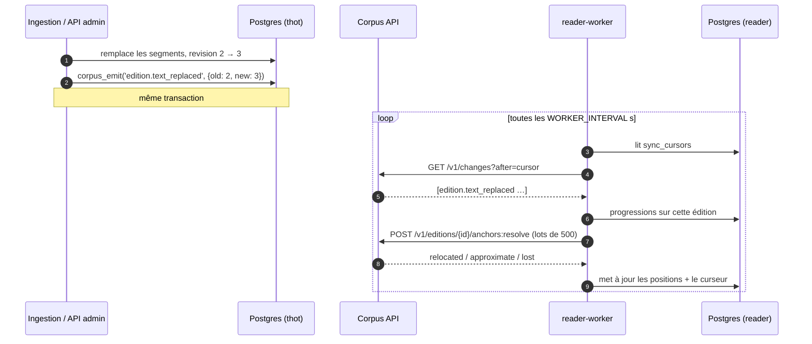
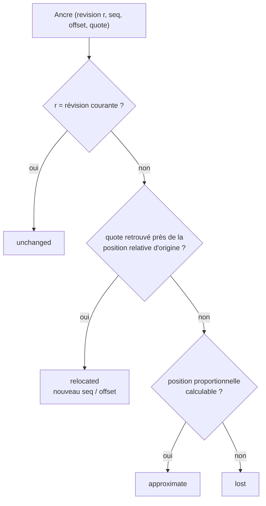

# Révisions, ancres et flux des changements

Le texte d'une édition peut être remplacé (nouvel EPUB, extracteur
amélioré). Les segments sont alors recréés et leurs `seq` peuvent changer.
Trois mécanismes évitent que les applications perdent les positions de
leurs utilisateurs.

## 1. La révision d'édition

`editions.revision` est incrémentée à chaque remplacement du texte. Toutes
les réponses de texte l'indiquent, et une réponse demandée avec `?rev=` est
immuable (donc cachable sans limite, y compris hors ligne).

Une modification de **structure** (sections) ne touche pas aux segments :
elle émet `edition.text_replaced` avec `reason = structure` pour que les
applications rafraîchissent la table des matières.

## 2. Les ancres

Une application ne stocke jamais l'UUID d'un segment mais une **ancre
complète**, sur le modèle *TextQuoteSelector* du W3C Web Annotation :

```json
{ "edition_id": "…", "revision": 2, "seq": 120, "offset": 37,
  "quote": { "exact": "Je ne l'ai pas tuée", "prefix": "— Non ! ", "suffix": " pour aider ma mère" } }
```

## 3. Le flux des changements

L'ingestion (et l'API d'administration) écrivent dans `corpus_events` **dans
la même transaction** que la modification, via `corpus_emit()`. Les
applications lisent `/v1/changes` à leur rythme, chacune avec son curseur.



## Recalage d'une ancre



## Types d'événements

| Type | `data` |
| --- | --- |
| `work.created` / `edition.created` | — |
| `work.updated` / `edition.updated` | `fields` modifiés (titre, auteurs, `access`…) |
| `work.alignment_changed` | référence, statut par édition |
| `edition.text_replaced` | `old_revision`, `new_revision` (ou `reason`) |
| `index.activated` | `collection`, `dense_model`, `chunker_version` |

La liseuse s'en sert pour recaler les progressions (`edition.text_replaced`)
et rafraîchir son cache d'œuvres (`work.updated`).
