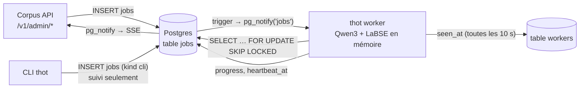
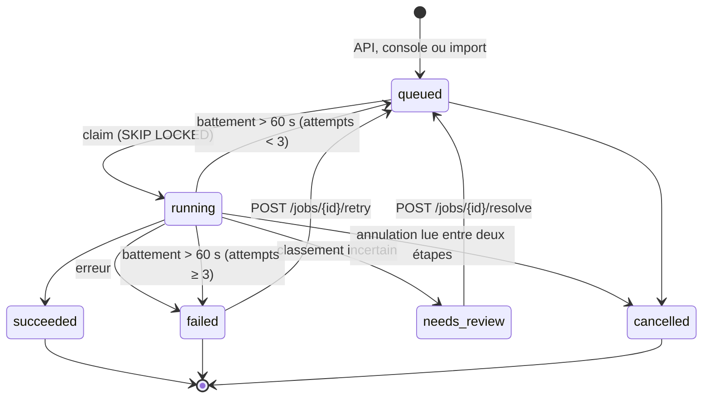
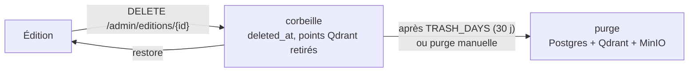

# Worker et file de tâches

Les traitements lourds demandés depuis la console (dépôts, retraitements,
alignements, corbeille) sont exécutés par **`thot worker`**, un processus
permanent qui garde les modèles chargés en mémoire. La file est une simple
**table `jobs` dans Postgres** : pas de Redis ni de Celery.

## Principe

- **Réveil** par `LISTEN jobs`, sinon toutes les 30 s.
- **Une tâche GPU à la fois** : Qwen3-Embedding-0.6B et LaBSE occupent
  ~2,5 Go sur les 8 Go d'une RTX 3070.
- **Prise atomique** : la plus ancienne tâche `queued` est passée en
  `running` avec `FOR UPDATE SKIP LOCKED` ; plusieurs workers peuvent
  coexister sans se marcher dessus.
- **Présence** : chaque worker met à jour la table `workers` (hôte, GPU,
  modèles chargés, tâche en cours) ; sans nouvelle depuis 60 s, la console
  le montre arrêté.

## Cycle de vie d'une tâche

- **Battement de cœur** toutes les 10 s pendant l'exécution ; au démarrage
  (et périodiquement), les tâches `running` dont le battement a plus de 60 s
  repartent en file, jusqu'à 3 tentatives.
- **Annulation** : lue entre deux étapes ; `extract` est transactionnel,
  `index` et `align` sont idempotents et reprennent proprement.
- Un **lot** (50 EPUB déposés d'un coup) = un job parent et 50 enfants
  (`parent_id`).

## Types de tâches

| `kind` | Enchaînement |
| --- | --- |
| `ingest` | identify → extract → quality → index → align |
| `reprocess` | après modification de structure : quality → index → align |
| `align` | réalignement d'une œuvre (option : à partir d'une section) |
| `sync_payload` | recopie fiche → payload Qdrant (titre, droits…) |
| `trash_edition` | mise à la corbeille : points Qdrant retirés |
| `restore_edition` | sortie de corbeille : réindexation, réalignement |
| `purge` | suppression définitive : Postgres, Qdrant, MinIO |
| `import_books` | import de `books/` (équivalent de `thot extract`) |
| `quality` | recalcul de la qualité (une édition ou toutes) |
| `cli` | exécution d'une commande `thot`, suivie mais non exécutée par le worker |

## Corbeille

Le worker lance la purge au plus une fois par heure, s'il y a quelque chose à
purger.

## Configuration

| Variable | Rôle |
| --- | --- |
| `EMBEDDING_MODEL`, `VECTOR_SIZE` | modèle dense des nouveaux index |
| `ALIGN_MODEL` | encodeur d'alignement (LaBSE) |
| `EMBED_BATCH_SIZE` | taille des lots d'encodage |
| `IDENTIFY_AUTO` | rattachement automatique des dépôts (`false` : tout valider) |
| `WIKIDATA_ENABLED` | interroger Wikidata pendant le classement |
| `TRASH_DAYS` | délai avant purge de la corbeille |
| `MINIO_INBOX_BUCKET` | bucket des dépôts |
